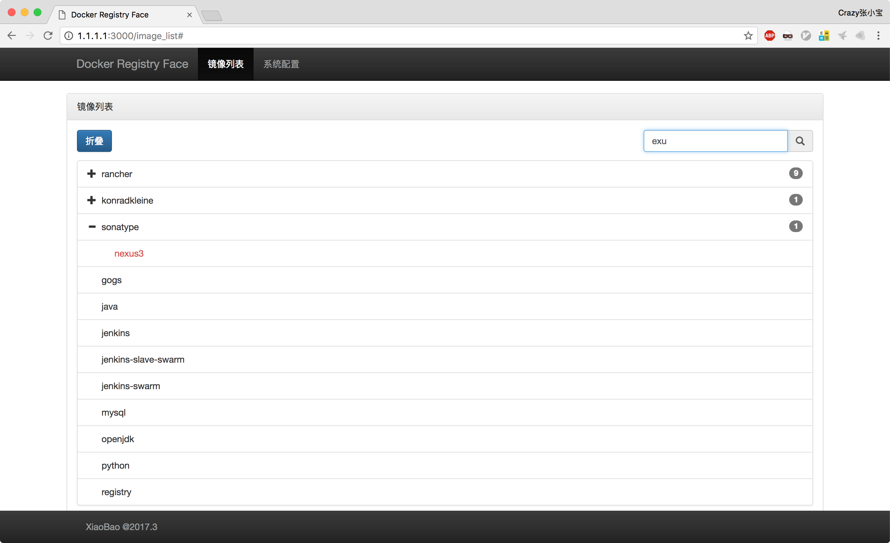
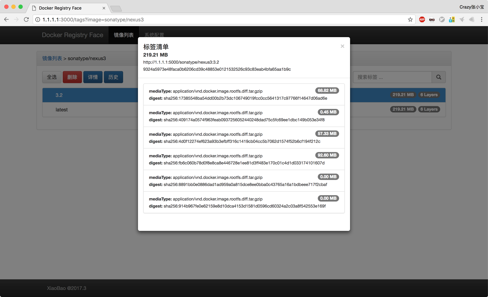
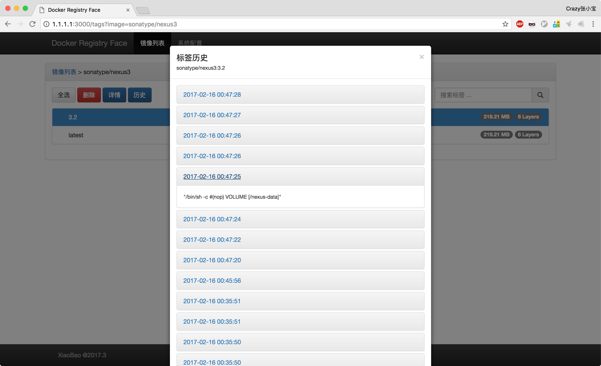
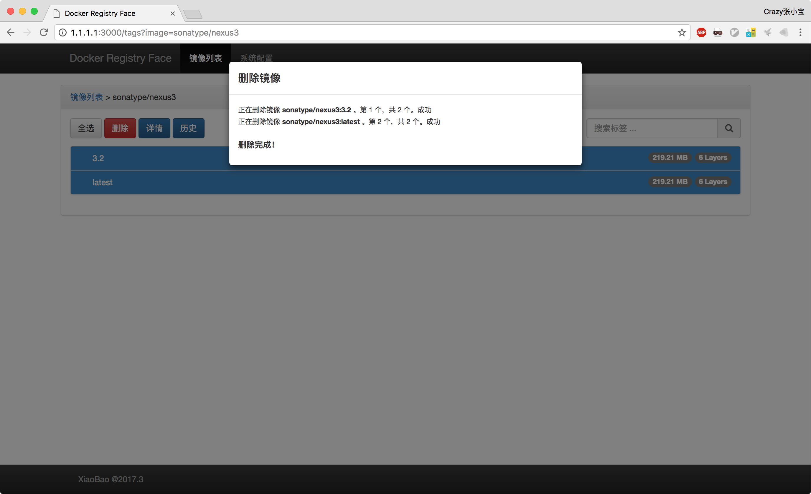

# Docker Registry Face

之前画的 [Lazy_balancer](https://github.com/v55448330/lazy-balancer) (Nginx WebUI) 推出之后广受好评。最近项目使用 Docker，一段时间内，因为持续集成的原因，每天会产生很多镜像，目前只能选择 Registry 、Nexus Repo 之类的产品，但是要么太重，要么太丑。想要点点鼠标就优雅的解决这个问题还是得靠自己，项目又诞生了。因为上一个项目使用了 Django，这里尝试使用 Flask。

非专业开发，代码凑合看。

> * 项目基于 [Flask](http://flask.pocoo.org/) + [Bootstrap](http://getbootstrap.com/) + [jQuery](http://jquery.com/) 构建，在 Python 2.7 上测试通过；为了保证良好的兼容性，请使用 Chrome 浏览器。
> * 为了轻量化，没有使用数据库等，配置将使用环境变量或者文件的方式保存；需要本地测试的同学请使用 Vagrant 或者 Docker 运行
> * 后端理论支持任何使用 Docker Registry V2 协议的仓库，如 Nexus，官方 Registry 等
> * 镜像路径最高只支持两级，如 xxxx/xxxx:xxx 或 xxxx:xxx

## 项目地址
- GITHUB - https://github.com/v55448330/docker-registry-face
- OSCHINA - http://git.oschina.net/v55448330/docker-registry-face

## 功能
* 支持镜像查询
* 支持镜像批量删除（API 删除）
* 支持镜像标签清单和历史操作记录查看
* 支持 Docker 方式部署
* 适配手机浏览器

## 运行
* 克隆代码
```
mkdir -p /app && cd /app
git clone https://github.com/v55448330/docker-registry-face.git
cd /app/docker_registry_face
```
* 安装运行环境
```
pip install -r pip-freeze.txt 
```
* 启动服务
```
python runserver.py
```
* 访问
```
http://[IP]:3000/  
```
> 若使用容器运行，请配置 `REGISTRY_URL`、`REGISTRY_USER`、`REGISTRY_PASS`，环境变量，此时配置将通过环境变量获取，并 **不可** 在页面修改！

## 演示





## 授权

本项目由 [小宝](http://www.ichegg.org) 维护，采用 [GPLv3](http://www.gnu.org/licenses/gpl-3.0.html) 开源协议。欢迎反馈！欢迎贡献代码！
